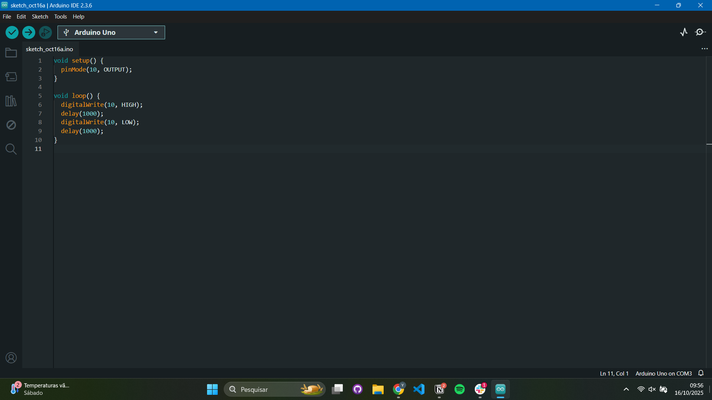
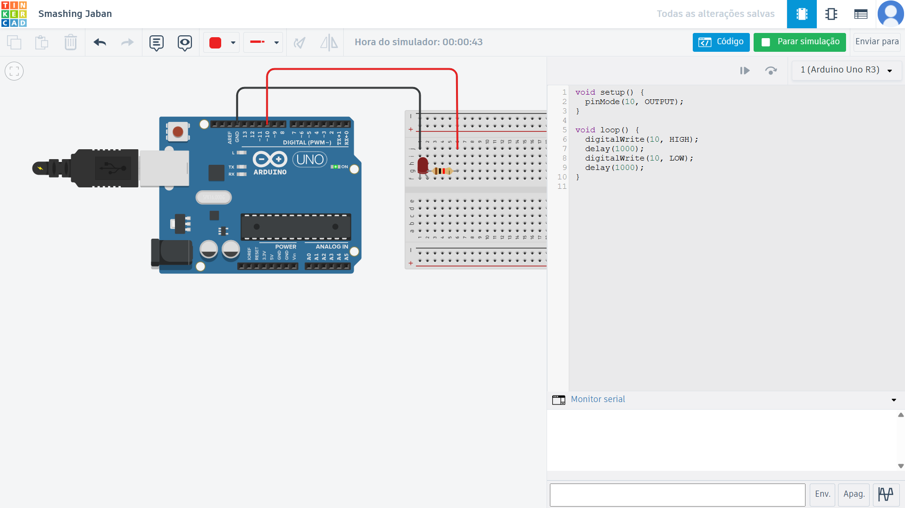

## Arduino IDE
As imagens e GIFs abaixo ilustram o funcionamento do Arduino físico e o seu código na Arduino IDE.

## Tinkercad
O código utilizado no Tinkercad é idêntico ao utilizado na versão física.

